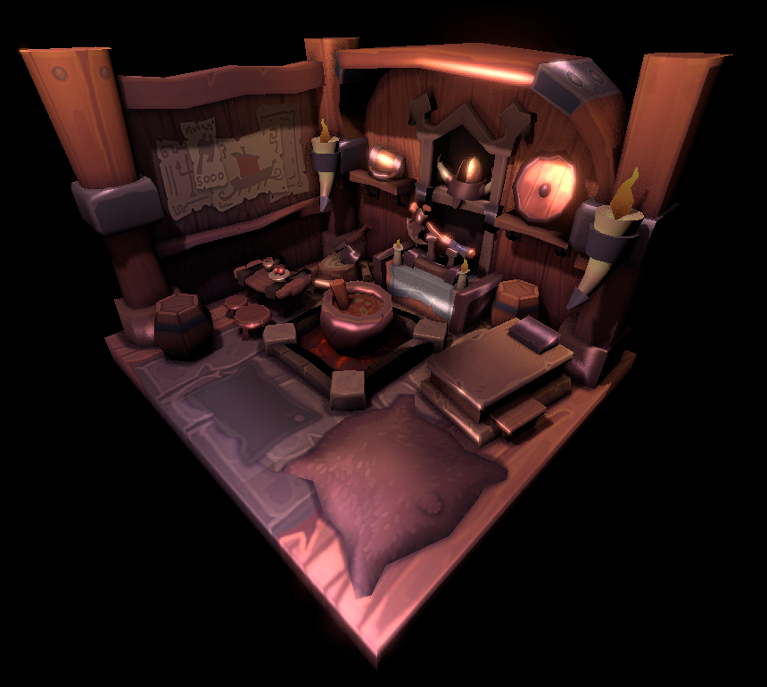
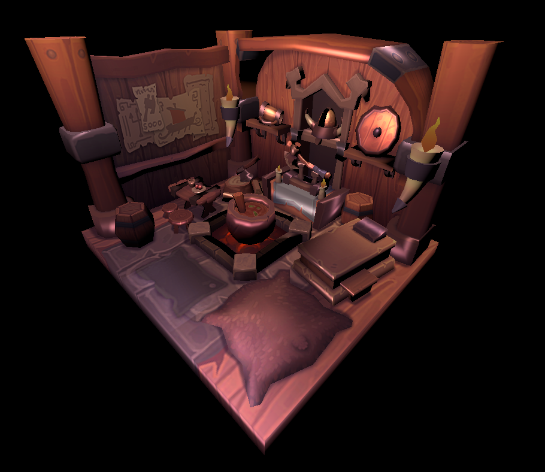
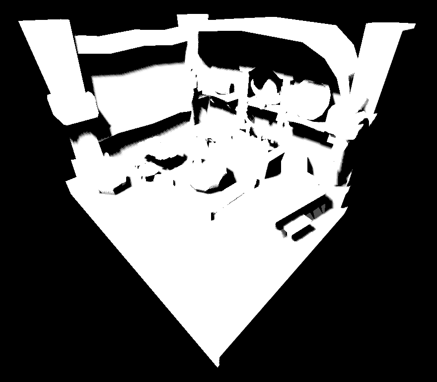
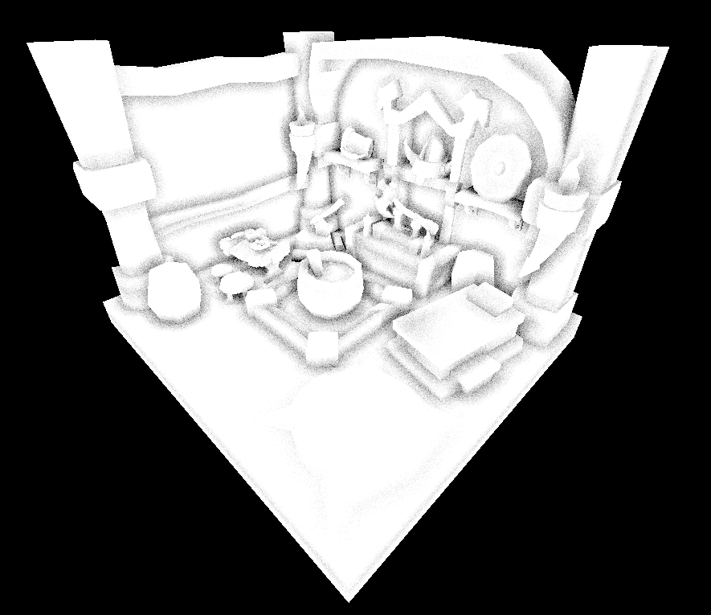
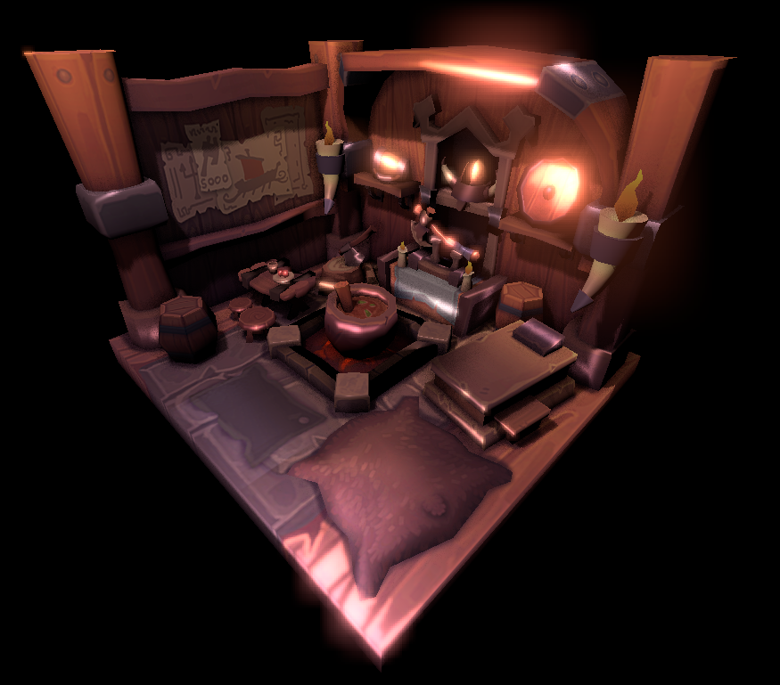
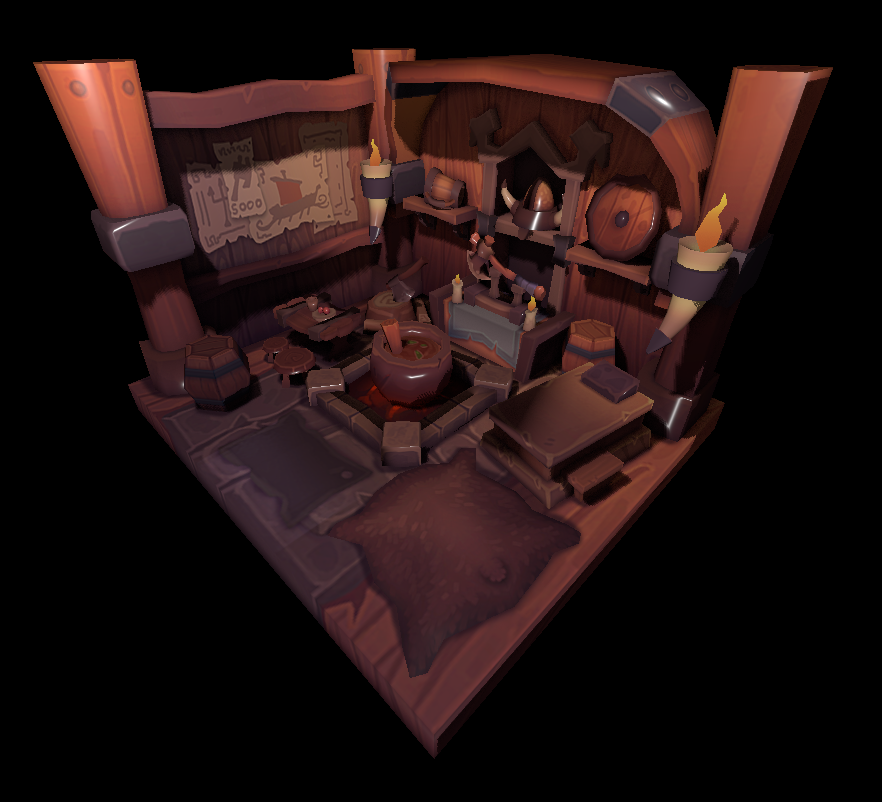

Compile environment: Windows, Cmake, Clang, Ninja, vcpkg

Dependency package: Vulkan, glfw3, ImGui

Please update your "CMAKE_TOOLCHAIN_FILE" in CMakeLists.txt before build.

Excutable file path: `./build/Debug/test.exe`

Note: This program is force set to 30 fps

Final Effect:

Blinn-Phong:

ShadowMap+PCF:

SSAO:

Bloom(in high parameter):

Particles:

PBR:

